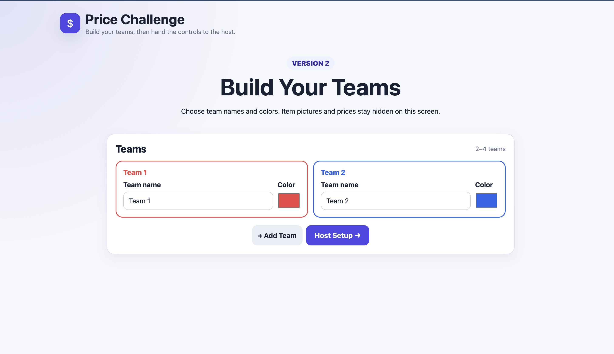
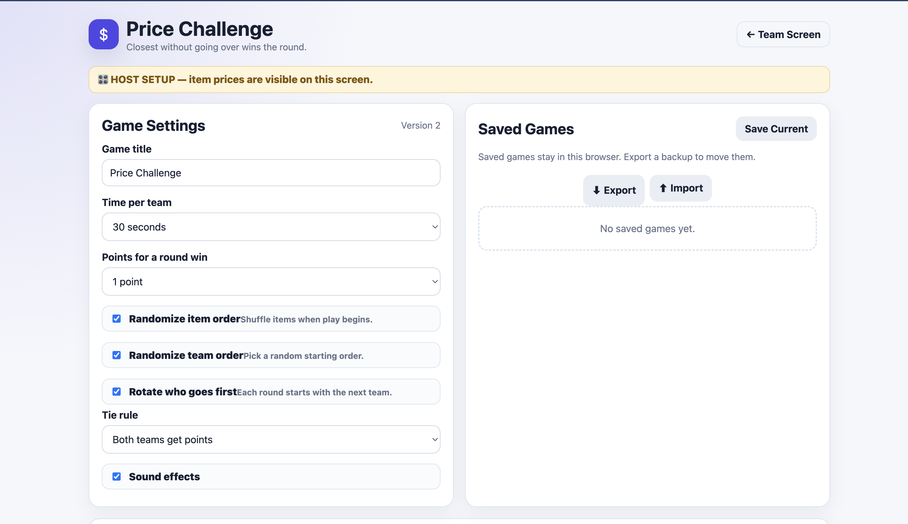

# Price Challenge — Interactive Team Game

Price Challenge is a classroom-friendly browser game inspired by classic TV price-guessing mechanics. It was built for real group use and supports 2–4 teams, timed private bidding, automatic scoring, host controls, saved games, and responsive presentation on laptops, tablets, projectors, and TVs.

The project was iterated after live use, with improvements added to make gameplay clearer, faster, and easier for the host to manage.

**[Open the live game](https://jarcen5.github.io/priceisright/)**

## Screenshots

### Game setup


The host can create or load a game, configure gameplay options, manage sound, and prepare the activity before players begin.

### Team setup


Teams can be created before gameplay begins, keeping item information separate from the setup flow and making the game easier to use with groups.

## Tech stack

- HTML5
- CSS3
- Vanilla JavaScript
- IndexedDB
- GitHub Pages

## Core features

- 2–4 customizable teams
- Team names and colors
- Configurable per-team timer: 15, 20, 30, 45, 60, or 90 seconds
- “Pass the device” ready screen so the timer does not run while teams switch
- Hidden locked bids until the reveal
- Automatic no-bid when a team runs out of time
- Closest-without-going-over scoring
- Tie support
- Running scoreboard
- Product photo upload with browser-side image resizing
- Reusable saved games stored in IndexedDB
- JSON export/import for backups and moving games between devices
- Optional sound effects
- Responsive layout for laptops, tablets, projectors, and TVs
- Reduced-motion support
- No server, database account, build step, or paid hosting required

## Host experience

Host controls are separated from the player-facing flow so the game can be run without exposing administrative options during play. The host can edit the game, manage sound, and control the experience while teams only see the information they need for their turn.

## Gameplay flow

1. Create teams and add products with their actual prices.
2. The app prompts the host to pass the device to the active team.
3. The team starts its timer and enters a bid.
4. The bid is locked and hidden.
5. After every team has played, the host reveals the price.
6. The app awards the point to the highest valid bid that does not exceed the actual price.

## UX and accessibility details

- Circular countdown plus timer bar
- Warning state at 10 seconds
- Final-five-second urgency state
- Sound cues for important game events
- Dramatic price reveal and winner celebration
- Collapsible host controls
- Reduced-motion support for users who prefer less animation

## Data and privacy

All game data stays in the browser unless the user exports a JSON backup. Saved games are device/browser specific and are stored with IndexedDB.

## Run locally

Because this is a static website, you can open `index.html` directly in most browsers.

For a local server:

```bash
python -m http.server 8000
```

Then open `http://localhost:8000`.

## Deployment

The project is deployed with GitHub Pages directly from the `main` branch and requires no build step.

## What this project demonstrates

This project demonstrates JavaScript state management, browser storage, file/image handling, responsive UI design, accessibility considerations, scoring/business logic, user-centered iteration, and deployment of a static web application for real users.
